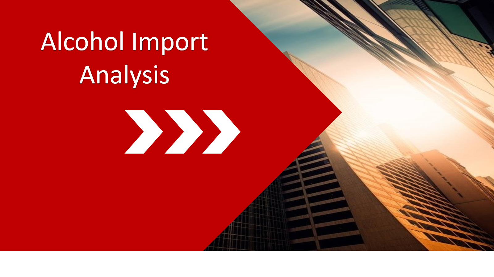
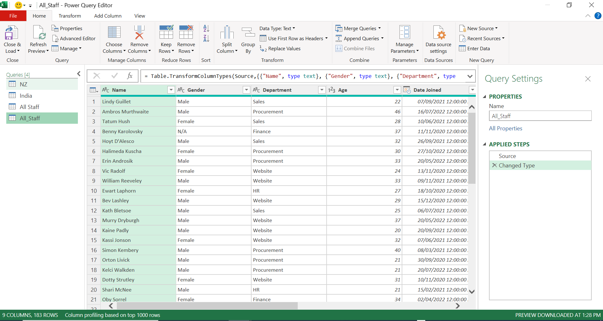
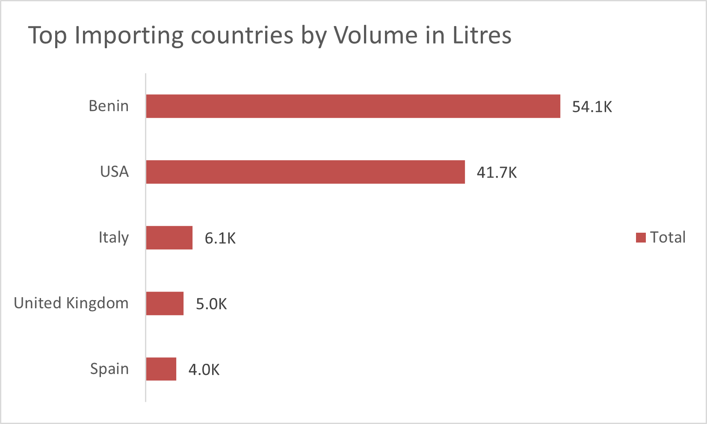
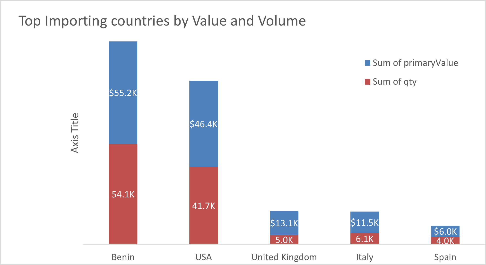
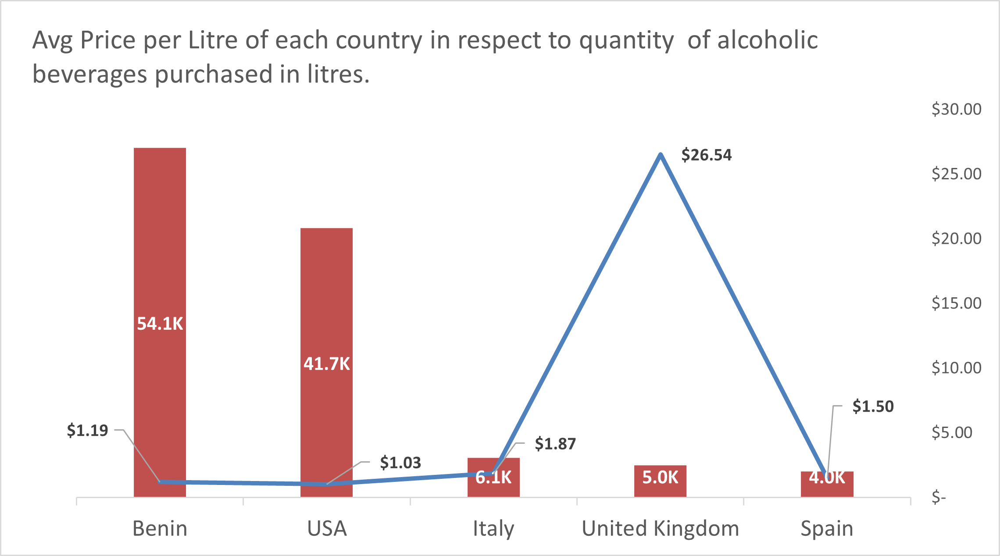
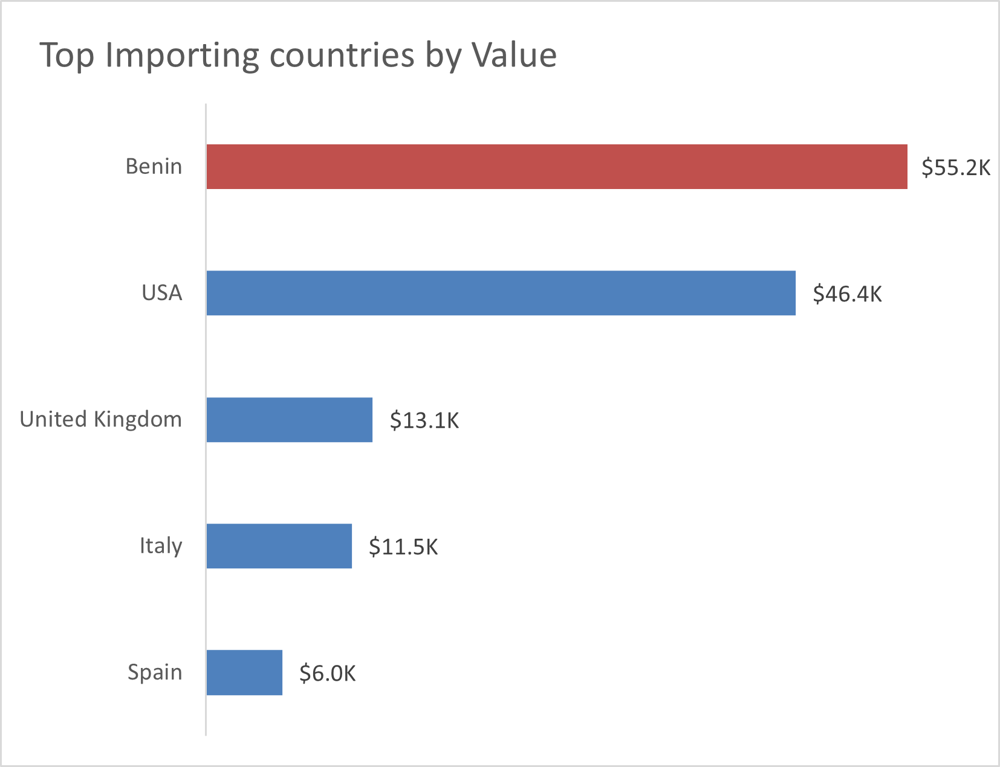

# You2can-Documentation

## Introduction
This report presents an analysis of alcohol import trends using data sourced from the United Nations Comtrade Database. The goal is to understand import patterns, identify major trading partners, observe year-on-year changes for Nigeria in 2023 to draw insights that can support trade-related decision-making.
## Problem Statement 
Despite the growing interest in alcoholic beverages, there is limited visibility into the specific trends and patterns of alcohol imports. Key questions include:
- Which countries are the top import sources?
- Top inporting countries by value and Volume?
- Price per Litre of Imports with respect to volume?
- Average price per country?
## Data Source
The primary data source for this analysis is the UN Comtrade Database. The dataset was extracted using the following parameters:
-	Reporter Country:  Nigeria
- Partner Countries: All
- Product: Alcoholic beverages (HS Codes 2203 – 2208)
- Period:  2023
- Trade Flow: Imports
## Data Transformation / Cleaning
This data was prepared and cleaned on Microsoft Excel and Power Query

## Insights 
Based on the analysis:
- It is cheaper to import from Benin at an avg price of $1.19
- Imports from the UK was an outlier in the analysis as the cost per litre is more than combined of the remaining countries.
- 

Top Imports                              |  Imports by value and volume 
:--------------------------------------: | :-----------------------------:
         | 

Avg price per litre                      |   Imports By Volume 
:--------------------------------------: | :-----------------------------:
             | 

## Recommendations
Based on the analysis:
- We encourage a deeper dive to understand the imports from benin as it is not an alcohol producing nation.
- Access to paid databases will help for more in-dept analysis, which will aid informed decision making. It is recommended that the company looks into subscribing for one or more, that meets its business requirements or current need.
- Explore potential for local substitutes in high-import categories (e.g., spirits).

 ## THANK YOU FOR TAKING THE TIME TO READ THROUGH THIS ANALYSIS. 🙏
 
 

